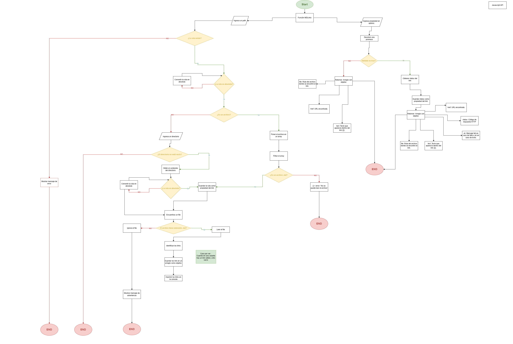

# Markdown Links

## Índice

* [1. General](#1-preámbulo)
* [2. Resumen del proyecto](#2-resumen-del-proyecto)
* [3. Instalación](#3-instalación)
* [4. Instrucciones de uso](#4-instrucciones-de-uso)
* [5. Issues](#5-issues)
* [6. Créditos](#6-créditos)

## 1. General

[Markdown](https://es.wikipedia.org/wiki/Markdown) es un lenguaje de marcado
ligero muy popular entre developers. Es usado en muchísimas plataformas que
manejan texto plano (GitHub, foros, blogs, ...) y es muy común
encontrar varios archivos en ese formato en cualquier tipo de repositorio
(empezando por el tradicional `README.md`).

Estos archivos `Markdown` normalmente contienen _links_ (vínculos/ligas) que
muchas veces están rotos o ya no son válidos y eso perjudica mucho el valor de
la información que se quiere compartir.

## 2. Resumen del proyecto

El proyecto MD-links es una herramienta de línea de comandos desarrollada en JavaScript que permite analizar y validar links en archivos Markdown. La herramienta recorre los archivos Markdown en una carpeta y verifica la validez de los links encontrados en ellos. También puede generar estadísticas y reportes sobre los links, como el número de links encontrados y el número de links rotos.

> Flowchart

## 3. Instalación

Es necesario tener una versión reciente de `node.js` instalada.
En tu terminal instalas la librería por npm con el siguiente comando:

`npm install git@github.com:CarolynYQ/MD-links.git`

Si deseas instalarlo como una dependencia:

`npm install --save --dev git@github.com:CarolynYQ/MD-links.git`

## 4. Instrucciones de uso

### Ejemplos
---------------
> Solo ruta

`cyq-mdlinks ruta/a/analizar`

```javascript
kingk@DESKTOP-H8RBQC8 MINGW64 ~/Laboratoria/MD-links  cyq-mdlinks 

[ 
	{
    href: 'https://www.universia.net/es/home.html',
    text: 'Universia',
    file: 'C:\\Users\\kingk\\Laboratoria\\MD-links\\src\\sample\\draft.md',
	},
]
```

> Ruta y validación

`cyq-mdlinks ruta/a/analizar --validate`

```javascript
kingk@DESKTOP-H8RBQC8 MINGW64 ~/Laboratoria/MD-links  cyq-mdlinks --validate 

[ 
	{
    href: 'https://www.universia.net/es/home.html',
    text: 'Universia',
    file: 'C:\\Users\\kingk\\Laboratoria\\MD-links\\src\\sample\\draft.md',
    status: 200,
    OK: 'ok'
	},
]
```

> Ruta y estados

`cyq-mdlinks ruta/a/analizar --status`

```javascript
kingk@DESKTOP-H8RBQC8 MINGW64 ~/Laboratoria/MD-links  cyq-mdlinks --status

[ 
	{
    href: 'https://www.universia.net/es/home.html',
    text: 'Universia',
    file: 'C:\\Users\\kingk\\Laboratoria\\MD-links\\src\\sample\\draft.md',
	},
]
{ Total: 1, Unique: 1, Broken: 0 }
```

> Ruta, Validación y estados

`cyq-mdlinks ruta/a/analizar --validate --status`

```javascript
kingk@DESKTOP-H8RBQC8 MINGW64 ~/Laboratoria/MD-links  cyq-mdlinks --validate --status

[ 
	{
    href: 'http://asinglepage.net/',
    text: 'asinglepage',
    file: 'C:\\Users\\kingk\\Laboratoria\\MD-links\\src\\sample\\draft.md',
    status: null,
    OK: 'fail'
	},
]

{ Total: 1, Unique: 1, Broken: 1 }
```


### Resumen
--------

|  path   |    --stats   |   --validate   |  Resultado |
| ------- | -------             | ------       | -----      | 
| ✔  |   ✖  |✔ | Solo ruta ---> href, text y file |
| ✔  | ✖ | ✔ | Ruta & validate ---->  href, text, file, status y OK|
| ✔  | ✔ | ✖ | Ruta & stats ---->  href, text, file y # de links totales, únicos y rotos|
| ✔  | ✔ | ✔ | Ruta & validate & stats ---->  href, text, file, status, OK y # de links totales, únicos y rotos|
## 5. Issues

Las funcionalidades para implementar a futuro son los siguientes [issues](https://github.com/CarolynYQ/MD-links/issues)

## 6. Créditos

Este trabajo fue creado con 💛 gracias a la colaboración de Carolyn Yaker