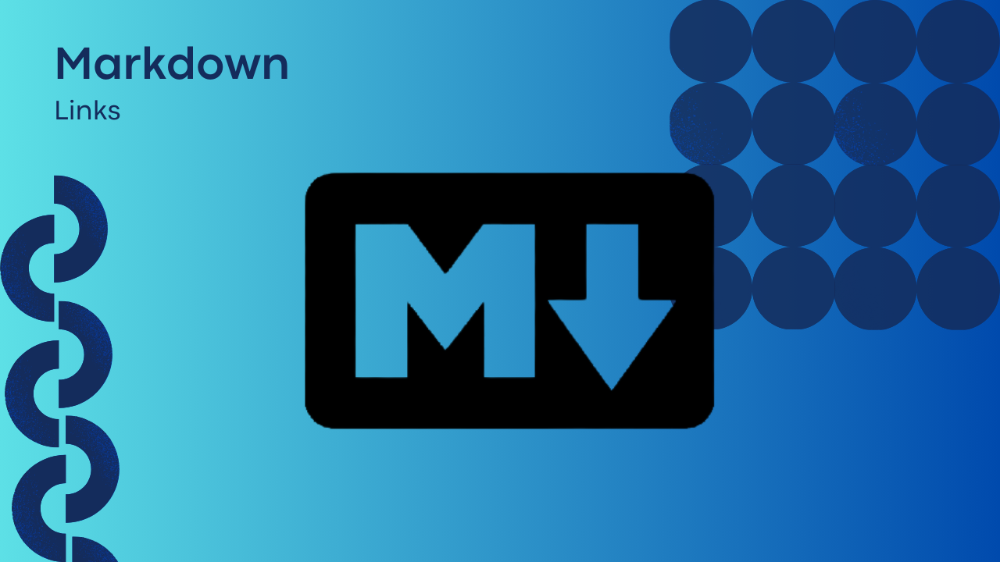

# Markdown Links

## Índice

* [1. General](#1-preámbulo)
* [2. Resumen del proyecto](#2-resumen-del-proyecto)
* [3. Instalación](#3-instalación)
* [4. Instrucciones de uso](#4-instrucciones-de-uso)
* [5. Issues](#5-issues)
* [6. Créditos](#6-créditos)

## 1. General

[Markdown](https://es.wikipedia.org/wiki/Markdown) es un lenguaje de marcado
ligero muy popular entre developers. Es usado en muchísimas plataformas que
manejan texto plano (GitHub, foros, blogs, ...) y es muy común
encontrar varios archivos en ese formato en cualquier tipo de repositorio
(empezando por el tradicional `README.md`).

Estos archivos `Markdown` normalmente contienen _links_ (vínculos/ligas) que
muchas veces están rotos o ya no son válidos y eso perjudica mucho el valor de
la información que se quiere compartir.

## 2. Resumen del proyecto

El proyecto MD-links es una herramienta de línea de comandos desarrollada en JavaScript que permite analizar y validar links en archivos Markdown. La herramienta recorre los archivos Markdown en una carpeta y verifica la validez de los links encontrados en ellos. También puede generar estadísticas y reportes sobre los links, como el número de links encontrados y el número de links rotos.

> Flowchart

## 3. Instalación

Es necesario tener una versión reciente de `node.js` instalada.
En tu terminal instalas la librería por npm con el siguiente comando:
	`npm install CYQ-mdlinks`

## 4. Instrucciones de uso
## 5. Issues
## 6. Créditos